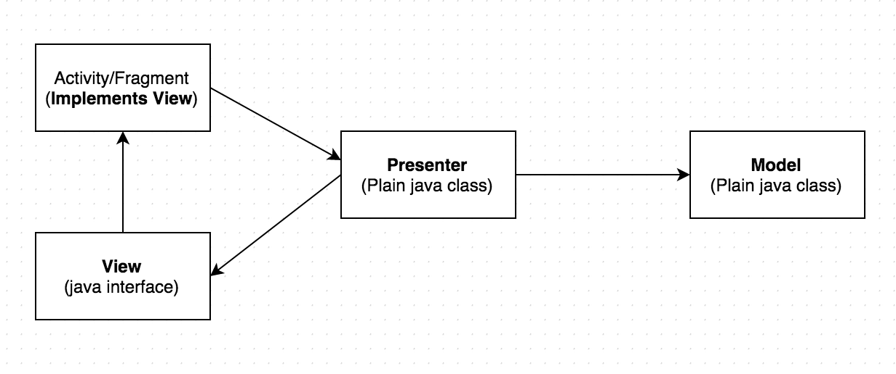

# MVP_Login_Sample

MVP stands for Model View Presenter which is used to improve the application architecture and 
inscrease testability. MVP is a pattern to make the Android code stay clean .

View : View is used to Show Data to User. View get Data from Presenter and show as it is to User.

Presenter : Presenter is glue between View and Model. Presenter gets the data from Model and apply logic and send it to the View. Presenter get Post data from View and apply validation and send it to API request.

Model : Model is basically a class like Object, where data is stored. API response stored into Model and then send it to the presenter.

Architecture of MVP

